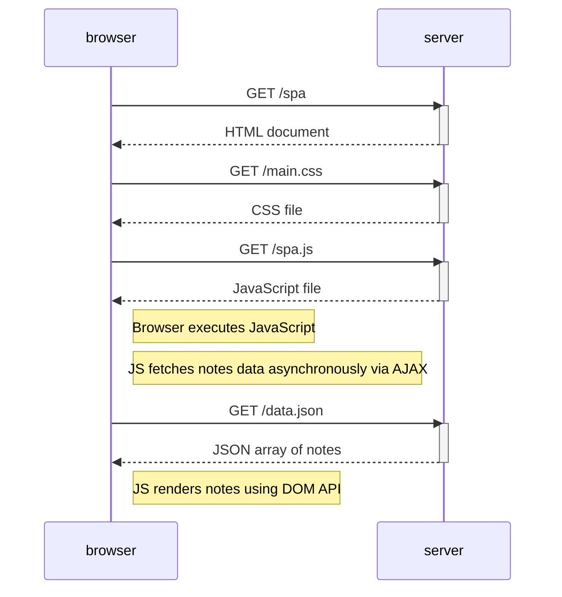

```mermaid
sequenceDiagram
    participant browser
    participant server

    browser->>server: GET /spa
    activate server
    server-->>browser: HTML document
    deactivate server

    browser->>server: GET /main.css
    activate server
    server-->>browser: CSS file
    deactivate server

    browser->>server: GET /spa.js
    activate server
    server-->>browser: JavaScript file
    deactivate server

    Note right of browser: Browser executes JavaScript
    Note right of browser: JS fetches notes data asynchronously via AJAX

    browser->>server: GET /data.json
    activate server
    server-->>browser: JSON array of notes
    deactivate server

    Note right of browser: JS renders notes using DOM API
    
```