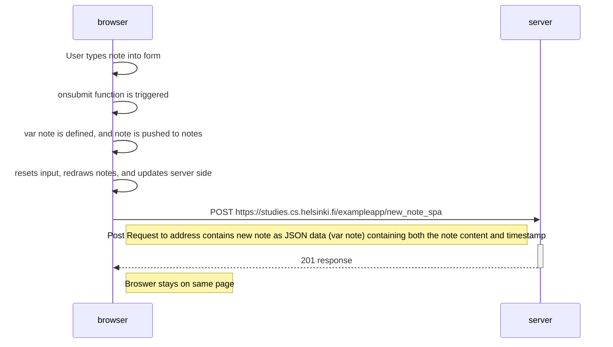

```mermaid
sequenceDiagram
    participant browser
    participant server

    browser ->> browser: User types note into form
    browser ->> browser: onsubmit function is triggered
    browser ->> browser: var note is defined, and note is pushed to notes
    browser ->> browser: resets input, redraws notes, and updates server side
    browser->>server: POST https://studies.cs.helsinki.fi/exampleapp/new_note_spa
    Note right of browser: Post Request to address contains new note as JSON data (var note) containing both the note content and timestamp
    activate server
    server-->>browser: 201 response 
    deactivate server    
    Note right of browser: Broswer stays on same page
```